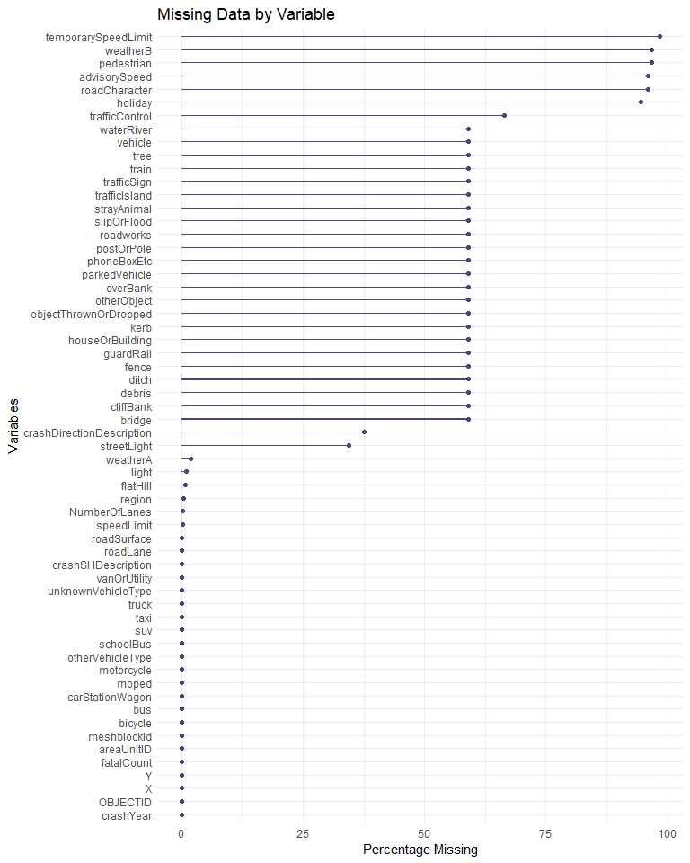

# Data-analysis-of-NZ-Crashes
Data analysis of NZ Crashes

## Purpose
Understand the relationship between fatalCount (the count of fatalities associated with a crash) and the rest of the variables in the Crash_Analysis_System_(CAS)_data data set.

## Overall Process
Whilst working on this project I handled data cleaning, data visualization and data analysis. I also used feature selection techniques, regression (Poisson and negative binomial), checked model assumptions and performed model evaluation.

## Data cleaning

On the NZTA's open data portal the Crash Analysis System data set has a set of field descriptions, contianing each variables name in the dataset and its description.

I found that the variables crashDistance, easting, northing, and roadMarkings are listed as in the data set on that page, but are not in the datasets csv.

The variables X, Y, objectID, and crashRoadSideRoad are in the data set but are not listed on this page. It seems like a reasonable assumption to say that the easting variable is the X variable and the northing variable is the Y variable in this dataset.

However there is no obvious link between the variables crashDistance, roadMarkings, objectID and crashRoadSideRoad. The variable crashRoadSideRoad is also entirely made up of NA's in the dataset. Because I cannot determine the exact meanings of the variables objectID, and crashRoadSideRoad I will be removing them from the data set.

There are also some small discrepencies in the variable names when comparing the field descriptions variable names to the data sets variable names: The variable intersectionMidblock mentioned in the field descriptions appears to be the variable intersection in the dataset. Likewise with roadCharacter1 and roadCharacter.

The variables fatalCount, crashSeverity, seriousInjuryCount and minorInjuryCount contain similar information and I'm choosing to drop crashSeverity, seriousInjuryCount and minorInjuryCount

There are a significant amount variables that give location data, such as X, Y, and region. For the purposes of this research much of this information is redundant, as a result I will be removing the following variables; crashLocation1, crashLocation2, directionRoleDescription and tlaName. The variables crashYear and crashFinancialYear contain similar information, and I am choosing to drop crashFinancialYear.

Derived variables: to avoid redundancy (and potential multicollinearity) I will be removing variables that are derived from another. The variable urban is derived from the variable speedLimit, since it contains the same information I will be removing it from the data set.

The following categorical variables were turned into factors so they can be passed to regression models later: crashDirectionDescription, crashSHDescription, flatHill, holiday, light, region, roadCharacter, roadLane, roadSurface, streetLight, trafficControl, weatherA, and weatherB.

### Missing data

It seems that most variables in the Crash data set have large amounts of missing data. Particularly temporarySpeedLimit, pedestrian, the encoded WeatherB variables, the encoded holiday variables, and advisorySpeed which appear to be majority missing data.

There are 55 variables with missing data out of 59. Six of these variables have 94% of their data missing. Twenty four variables have between 66% and 58% of their data missing. Two variables had around 35% of their missing. The other twenty three variables had less than 2% of their data missing.

## Conclusion
My final model was a negative binomial model with predictors speedLimit, motorcycle, roadLane, truck, region, NumberOfLanes, otherVehicleType, crashSHDescription, carStationWagon and flatHill.

The coefficients of the the regions Gisborne, Marlborough, Nelson, Southland and Tasman aren’t statistically significant which means that there is no statistically significant difference in the count of deaths for a car crash (fatalCount) between those regions and the reference level Auckland. However other regions have a statistically significant difference in the count of deaths for a car crash when compared to Auckland.

The variable flatHill is statistically insignificant however I will not be removing this variable from the data due to the fact that stepwise BIC keeps this variable in the model.

The variables are on extremely different scales, which could be affecting the specific values of regression coefficients, however this does not affect the statistical significance or interpretation of the coefficients.

Each observation in this data set could have a different number of people in the car at the time of the crash which will affect the total number of possible fatalities for that car crash, this is difficult to account for.

Unfortunately the total number of people in the car at the time of the crash for each observation is unreported and I cannot determine a way to derive this variable from the variables in the data set. If the number of people in the car for each observation had been recorded then I would have treated this variable as an exposure variable and I would have used this variable as an offset in my model.

I started this project with the intent of understanding the relationships between fatalCount (the count of fatalities associated with a crash) and the other variables in the data set. I have fit a model that provides information about the relationship each variable has with the response (whether it is negative or positive, and whether it is statistically significant). I also found that the data follows a negative binomial distribution.

## References and citations
Waka Kotahi NZ Transport Agency. (n.d.). CAS data field descriptions and data set. Retrieved May 19, 2025, from https://opendata-nzta.opendata.arcgis.com/pages/cas-data-field-descriptions

